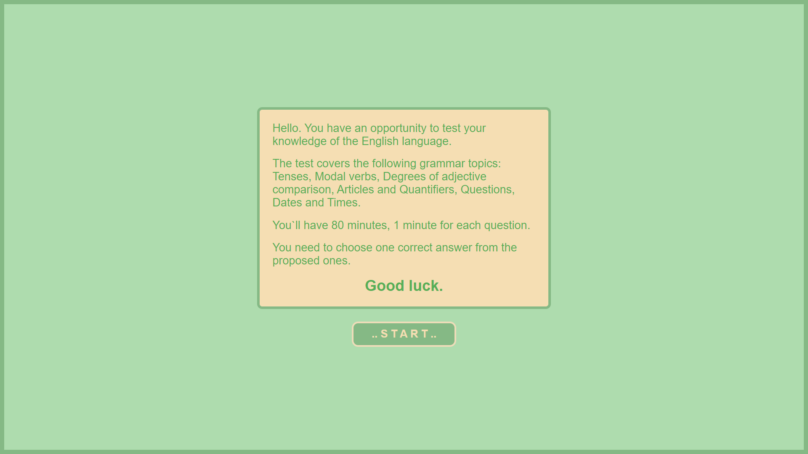
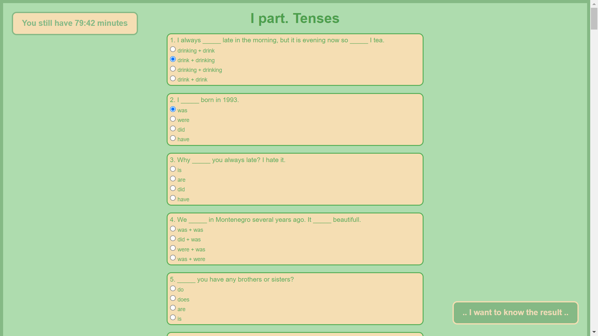
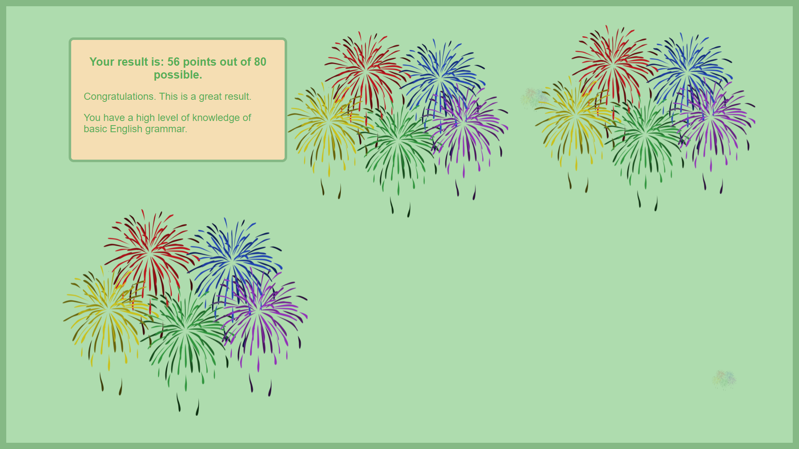

# English test

This project uses **React** and implements the following logic and visual effects:
+ flex-box;
+ adaptive layout;
+ Hooks (useState, useEffect);
+ Window.location for changing URL;
+ setInterval for timer logic;
+ ranges of results depending on the number of points.

## For the deployment of this project is used Netlify.
[Link for my project](https://resplendent-faloodeh-4237ed.netlify.app)

